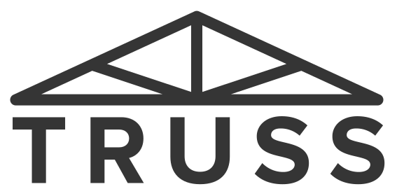

<p align="center" style="padding: 100px">
  
</p>

<div align="center">
  
  
  <hr />
</div>

Truss is a TypeScript DSL for writing utility CSS (think Tailwinds or Tachyons) in React/JSX, but on top of existing CSS-in-JS libraries (i.e. Emotion, MUI, and Fela).

## Quick Features

Truss lets you:

- Write `<div css={Css.mt1.black.$}>`, which Truss turns into `css={{ margin-top: 8px, color: "black" }}`, and then Emotion (or another CSS-in-JS library) turns into injected CSS classes.

- Setup your project's design system (palette, fonts, increments, and breakpoints) in Truss's configuration ([see example code](https://github.com/homebound-team/truss/blob/main/integration-test/index.ts#L12) and the "Customization" section below)

- Achieve both utility-class brevity and critical-CSS delivery.

- Output dynamic style values as needed, i.e. `Css.mt(someValue).$` or `Css.mt0.if(someCondition).mt4.$`.

Also see the "Why This Approach?" section for more rationale.

## Quick Intro

Truss generates a `src/Css.ts` file in your local project; this file exports a `Css` const that you use like:

```typescript
import { Css } from "src/Css";

const css = Css.mx2.black.$;
```

The last `.$` is like a `.build()` or `.finish()` method that converts the DSL object, with its fluent abbreviation getters/methods (like `mx2` and `black`), into just a regular POJO (plain old JavaScript object), as if you'd written by hand:

```typescript
const css = {
  // added by .mx2
  marginLeft: "16px",
  marginRight: "16px",
  // added by .black
  color: "#000000",
};
```

You can then pass this POJO to whatever CSS-in-JS framework you're using, i.e. with Emotion you would do something like:

```tsx
/** @jsxImportSource @emotion/react */

function MyReactComponent(props: MyProps) {
  // Use emotion's css prop
  return <div css={Css.mx2.black.$}>content</div>;
}
```

And in your HTML output, you'd get an Emotion-generated `.emotion-0` CSS class with the three `marginLeft`, `marginRight`, `color` properties set. (If you were to use Truss with Fela's `fe` JSX factory/`css` prop, you'd get three CSS classes, `a`, `b`, and `c`.)

See the "Common CSS-in-JS Frameworks" section below for Fela and MUI examples.

## Installation

- `npm i --save-dev @homebound/truss`
- Add a `truss` command to your `package.json`:
  ```json
  {
    "scripts": {
      "truss": "truss"
    }
  }
  ```
- Copy/paste an initial [truss-config.ts](https://raw.githubusercontent.com/homebound-team/truss/main/packages/template-tachyons/truss-config.ts) into your project
  - `wget https://raw.githubusercontent.com/homebound-team/truss/main/packages/template-tachyons/truss-config.ts`
- Run `npm run truss`
  - Re-run `npm run truss` anytime you change `truss-config.ts`
- Start using `Css.mt1.etc.$` in your project's CSS-in-JS setup

We recommend checking the `src/Css.ts` file into your repository, with the rationale:

- Your design system will likely be pretty stable, so the `Css.ts` output should rarely change.
- When it does change, it can be nice to see the diff-d output in the PR for others to review.
- It's the simplest "just works" setup for new contributors.

Granted, you're free to not check-in `src/Css.ts` and instead `.gitignore` it.

## Configuration

Truss's configuration is all done in the `truss-config.ts` files that are installed in your local project.

See the comments in [that file](https://github.com/homebound-team/truss-project-files/blob/main/index.ts) for the available config options.

## Psuedo-Selectors and Media Queries

Unlike Tachyons and Tailwinds, Truss's DSL does not have abbreviations/method names for psuedo-selectors and media queries.

Instead of building these complications into the DSL, with Truss you use your CSS-in-JS framework-of-choice's existing psuedo-selector and media query support.

For example, using Emotion you would do hover-specific styling like:

```tsx
/** @jsxImportSource @emotion/react */

function MyReactComponent(props: ...) {
  return (
    <div css={{...Css.mx2.black.$, "&:hover": Css.blue.$ }}>
      content
    </div>
  );
}
```

And breakpoints like:

```tsx
/** @jsxImportSource @emotion/react */
import { Css, sm } from "src/Css";

function MyReactComponent(props: MyProps) {
  return <div css={{ ...Css.mx2.black.$, [sm]: Css.mx1.$ }}>content</div>;
}
```

Where `sm` is just a regular media query string, i.e. `@media (max-width: 420px)`, that you can either generate with Truss's `breakpoints` config setting or just write your own by hand.

This leveraging of the existing framework's selector support makes Truss's DSL shorter and simpler than Tachyons/Tailwinds, which have to repetively/pre-emptively mixin hover/media variations for each size into each abbreviation.

## Common CSS-in-JS Frameworks

Truss generates a TypeScript/`Css.ts` DSL that, without any changes, can be used in MUI, Emotion, and Fela.

See the `./integration-test` directory in Truss's repo for running unit tests for each of the these frameworks.

### Emotion

```tsx
function FooComponent() {
  return <div css={Css.black.$}>root</div>;
}
```

### Fela

```tsx
function FooComponent() {
  return <div css={Css.black.$}>root</div>;
}
```

```tsx
function FooComponent() {
  const { css } = useFela();
  return <div className={css(Css.black.$)}>root</div>;
}
```

### MUI

```tsx
const useStyles = makeStyles({ root: Css.black.$ });

function FooComponent() {
  const styles = useStyles();
  return <div className={styles.root}>root</div>;
}
```

## XStyles / Xss Extension Contracts

Truss liberally borrows the idea of type-checked "extension" CSS from the currently-unreleased Facebook XStyles library (at least in theory; I've only seen one or two slides for this feature of XStyles, but I'm pretty sure Truss is faithful re-implementation of it).

As context, when developing components, you often end up with "properties that are okay for the caller to set" (i.e. that you as the component developer support the caller setting) and "properties that are _not_ okay for the caller to set" (i.e. because the component controls them).

Basically, you want to allow the caller to customize _some_ styles of the component, typically things like color or margin or font size, but not give them blanket control of "here is a `className` prop, do whatever you want to my root element", which risks "radical"/open-ended customization that then you, as the component developer, don't know if you will/will not unintentionally break going forward.

(I.e. see [Layout isolated components](https://visly.app/blog/layout-isolated-components) for a great write up of "parents control margin, components control padding".)

With Truss, you can explicitly declare a contract of styles allowed to be set on your component, i.e.:

```tsx
import { Css, Only, Xss } from "src/Css";

// Declare the allowed/supported styles
export type DatePickerXss = Xss<"marginLeft" | "marginRight">;

// Update the props to accept an `xss` prop to accept the customizations
export interface DatePickerProps<X> {
  date: Date;
  xss?: X;
}

// Use the `Only` type to ensure `xss` prop is a subset of DatePickerXss
export function DatePicker<X extends Only<DatePickerXss, X>>(props: DatePickerProps<X>) {
  const { date, xss } = props;
  // The component controls marginTop/marginBottom, and defers to the caller for marginLeft/marginRight
  return <div css={{ ...Css.my2.$, ...xss }}>{date}</div>;
}
```

Here we're allowing callers to set `marginLeft` or `marginRight`, i.e. this line will compile because `mx2` is statically typed as `{ marginLeft: number; marginRight: number }`, and so is a valid `xss` value:

```tsx
<DatePicker xss={Css.mx2.$} date={...} />
```

However, this line will not compile because `mt2` is statically typed as `{ marginTop: number }`, and `marginTop` is not allowed by `DatePickerXss`:

```tsx
<DatePicker date={...} xss={Css.mt2.$} />
```

The `Css` DSL also iteratively types itself, i.e. `Css.ml1.mr2.$` is still statically typed as `{ marginLeft: number; marginRight: number }`, instead of being based just on the last-used abbreviation.

Note that Truss conventionally uses the `xss` prop name for "the component's allowed extension styles" as a play on Emotion's `css` prop, with the `x` representing the "extension" concept. But there is otherwise nothing special about the name of the `xss` prop; i.e. you could use `xstyles={...}` which I believe is what the Facebook XStyles library does, or your own convention.

Also note that the XStyles/Xss feature is completely opt-in; you can use it if you want, or you can use Truss solely for the `Css.m2.black.$` abbreviations.

## Customization

Truss supports several levels of customization:

1. Per-project fonts/colors/etc.
2. Per-project rule additions or changes
3. Forking

### Per-Project Fonts/Colors/Etc

Each project that uses Truss gets a local `index.ts`, checked into its repo essentially as a config file, that defines in TypeScript the core settings, i.e.:

```typescript
const increment = 8;
const numberOfIncrements = 4;

const palette = {
  Black: "#353535",
  MidGray: "#888888",
  LightGray: "#cecece",
  White: "#fcfcfa",
  Blue: "#526675",
};

const fonts = {
  f24: "24px",
  f18: "18px",
  f16: "16px",
  f14: "14px",
  f12: "12px",
  // Can also set multiple properties if necessary
  f10: { fontSize: "10px", fontWeight: 500 },
};

const breakpoints = { sm: 0, md: 600, lg: 960 };

// ...rest of the config file...
```

Projects should heavily customize these settings to match their project-specific design system, then run `npm run generate` to get an updated `Css.ts`, i.e. after adding `Green: "green"` as a color in `palette`, the `Css.ts` file will automatically have utility methods added like:

```typescript
  get green() { return this.add("color", "green"); }
  get bgGreen() { return this.add("backgroundColor", "green"); }
  get bGreen() { return this.add("borderColor", "green"); }

```

### Per-Project Utility Methods

In the same `index.ts`, projects can add their own new abbreviations/utility methods:

```typescript
const sections = {
  ourSection: () => [newMethod("someAbbreviation", { color: "#000000" })],
};
```

Will result in `Css.ts` having a line that looks like:

```typescript
  // ourSection
  get someAbbreviation() { return this.add("color", "#000000"); }
```

Which can then be used as `Css.m2.someAbbreviation.$`.

Besides adding one-off additional methods, if your project wants to replace a whole section of Truss's out-of-the-box methods, you can do this via:

```typescript
const sections = {
  // Prefer app-specific border radiuses
  borderRadius: () =>
    newMethodsForProp("borderRadius", {
      br4: "4px",
      br8: "8px",
      br16: "16px",
    }),
};
```

Where `borderRadius` matches the name of the section in Truss's [sections](https://github.com/homebound-team/truss/tree/main/src/sections) directory (which generally matches Tachyon's organization).

### Forking

At the end of the day, Truss is small and hackable such that forking it to make the abbreviations "strict Tachyons" or "strict Tailwinds" or "whatever best fits your project/conventions/styles" should be easy and is kosher/encouraged.

The core Truss feature of "make a TypeScript DSL with a bunch of abbreviations" is also basically done, so it's unlikely you will miss out on some future/forthcoming amazing features by forking.

And, even if so, the coupling between Truss and your application code is limited to the `Css.abbreviations.$` lines that should be extremely stable even if/as the core of Truss evolves.

## Why This Approach?

Truss's approach is "Tachyons-ish" (or Tailwinds-ish), insofar as having short/cute utility class definitions.

However, the abbreviations are runtime resolved to object-style CSS-in-JS rules that are then injected into the DOM by Emotion (or your CSS-in-JS framework of choice), as if the rules had originally been written long-form.

The benefits of this approach are:

- We get the brevity + "inline-ness" of Tachyons/Tailwinds.

- It delivers critical CSS, i.e. we don't need the large static TW/Tachyons CSS files.

  (My reading of projects like [tachyons-styled-react](https://github.com/tachyons-css/tachyons-styled-react), from the creator of Tachyons, is that critical-ness is still important goal/improvement even for static-utility-class approaches like Tachyons.)

- Psuedo-selectors/breakpoints go through Emotion/the CSS-in-JS framework, which is simpler, more powerful, and reduces method/abbreviation bloat.

  I.e. we don't need to suffix `-nl` for "not large" onto every single abbreviation.

- "Regular Emotion/CSS-in-JS" is easily/inherently available as an escape hatch for places where utility classes don't make sense.

  It's very likely you'll need "not utility" styles at some point in your project, and because Truss's DSL is already going through Emotion/CSS-in-JS anyway, it means your one-off "not utility" styles will use the same/consistent CSS-in-JS output/generation pipeline.

  This means you don't end up with mixed idioms of `className="mx2 black"` for 90% of your styles, but then "something different" like `css={...}` for the last 10%.

- Projects can easily tweak their preferred styles/abbreviations.

  Granted, this is very similar in spirit to Tailwinds customization, but for Truss, the config process is "just change some TypeScript code and run `generate`", and doesn't involve any changes to your build/webpack/PostCSS/etc. setup.

## Why Tachyons Instead of Tailwinds?

Truss's out-of-the-box abbreviations are based on Tachyons. The reasons for this are:

1. Historically we started using Tachyons and Tachyons-style abbreviations before Tailwinds had obviously won the utility CSS mindshare, and so we have both legacy code and also just personal preference established for the Tachyons abbreviations.

2. The Tachyons abbreviations are generally more succint, and in our opinion if you're going to learn an esoteric way of writing CSS (e.g. learning what all of the abbreviations mean), you might as well go all the way and get the most brevity as possible, to achieve the best inline-ability.

That said, it's possible to use Truss to generate Tailwinds-based abbreviations; see [this issue](https://github.com/homebound-team/truss/issues/65) if you're interested in helping contribute.

## Themes

The word "theme" can mean either "static themes" (i.e. using the same consistent colors/fonts throughout your app, but the values themselves never really change) or "dynamic themes" (i.e. the user changing from light mode to dark mode).

For static themes, Truss's `index.ts`/`palette.ts` are specifically setup to centrally define your application's fonts, colors, etc. (see the "Configuration" section), so that they are consistently applied through your application.

For dynamic themes, Truss doesn't have any features dedicated explicitly to support them, but you can easily use CSS variables in your methods, i.e.:

```typescript
const palette = {
  Primary: "var(--primary)",
  Secondary: "var(--secondary)",
};
```

And then have your application handle setting the `--primary` / `--secondary` values as appropriate (i.e. by importing a `dark-mode.css` or `light-mode.css` which define the respective CSS variable values).

## Inspiration

Several libraries influenced Truss, specifically:

- [Typed Tailwinds](https://typed.tw) and [babel-plugin-tailwind-components](https://github.com/bradlc/babel-plugin-tailwind-components) are both "type-safe TypeScript utility-css DSLs".

  In particular, the babel-plugin-tailwind-components insight of "if you just make `csstype`-compliant object literals, you can bring them to whatever CSS-in-JS framework you want" was a very useful/inspirational insight.

  The main difference between Truss and both Typed.tw and babel-plugin-tailwind-components is that Truss doesn't try to "perfectly match Tachyons or Tailwinds" (see "Why This Approach?"). Specifically, both projects assume that a `tachyons.css` or `tailwinds.css` file is the source-of-truth for your project's rules (and so parse/generate the TypeScript code from that CSS file); however, with Truss your source-of-truth is Truss's out-of-the-box TypeScript rules + whatever customizations you make in your project's `truss/index.ts` file (so rules are defined directly in TypeScript).

- Facebook's XStyles for the "typed extension" idea

## Contributing

The Truss repository is set up as a Yarn workspace, although really the core package is just `packages/truss`, and the other packages are only for testing Truss with various output and various CSS-in-JS engines.

A basic development flow is:

- In the root directory, run `yarn`
- In the root directory, run `yarn build -w`
- Iterate as you want
- In the root directory, run `yarn test` to run all tests
  - Running individual tests in your IDE/each package should work as well

## Todo

- `npx -p @homebound/truss init` type experience for setup - inspired by [Storybook](https://storybook.js.org/docs/guides/quick-start-guide/)
- Support `number[]` increments as config
- Babel plugin that evaluates `Css...$` expressions at build-time
  - I.e. see babel-plugin-tailwind-components and [typed.tw's implementation](https://github.com/dvkndn/typed.tw/tree/master/webpack-loader)
- Server-side generation; in theory this should just work?
- Add [goober](https://github.com/cristianbote/goober#css-prop) example
