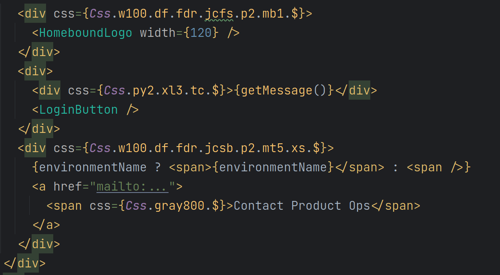

<p align="center" style="padding: 100px">
  
</p>

<div align="center">
  
  
  <hr />
</div>

Truss is a TypeScript DSL for writing utility CSS (think Tailwinds or Tachyons) in React/JSX, dedicated to [StyleX](https://stylexjs.com/), Facebook's build-time CSS-in-JS library, on web and React Native on mobile.

## Quick Features

Truss lets you:

- Write `<div css={Css.mt1.black.$}>`, which Truss compiles through StyleX into static CSS output on web.

- Setup your project's design system (palette, fonts, increments, and breakpoints) in Truss's configuration ([see example config](https://github.com/homebound-team/truss/blob/main/packages/template-tachyons/truss-config.ts) and the "Customization" section below)

- Achieve both utility-class brevity and critical-CSS delivery.

- Output dynamic style values as needed, i.e. `Css.mt(someValue).$` or `Css.mt0.if(someCondition).mt4.$`.

- Use selectors and breakpoints as needed, i.e. `Css.onHover.black.$` or `Css.ifSm.mx1.$`

- Use Tachyons-based abbreviations for superior inline readability (see [Why Tachyons](#why-tachyons-instead-of-tailwinds))

- Get immediate access to a built-in "cheat sheet", just control-click into abbreviations/methods to see what they do

Also see the "Why This Approach?" section for more rationale.

## Quick Example

Here's an example of production code using Truss:

<p align="center" style="padding: 100px">
  
</p>

## Quick How It Works

Truss generates a `src/Css.ts` file in your local project; this file exports a `Css` symbol that you use like:

```typescript
import { Css } from "src/Css";

const css = Css.mx2.black.$;
```

Where `Css.` signals "the start of your CSS styling", and `.$` signals "the end of your CSS styling".

In between, you can chain as many abbreviations/methods as you want, and they will all be statically typed and compile through StyleX on web or resolve to a plain style object on mobile.

```typescript
const css = {
  // added by .mx2
  marginLeft: "16px",
  marginRight: "16px",
  // added by .black
  color: "#000000",
};
```

On web, Truss is used with StyleX; you can write:

```tsx
function MyReactComponent(props: MyProps) {
  return <div css={Css.mx2.black.$}>content</div>;
}
```

At build time, Truss + StyleX transform this into static CSS rules.

On mobile, the same chain gives a plain style object for React Native:

```tsx
function MyNativeComponent() {
  return <View style={Css.mx2.black.$} />;
}
```

## Installation

For v2 web usage, StyleX is the default target, so you can use the `truss` command to generate `Css.ts` (+ `Css.json`) from your `truss-config.ts`:

- `npm i --save-dev @homebound/truss`
- Add a `truss` command to your `package.json`:
  ```json
  {
    "scripts": {
      "truss": "truss"
    }
  }
  ```
- Copy/paste an initial [truss-config.ts](https://raw.githubusercontent.com/homebound-team/truss/main/packages/template-tachyons/truss-config.ts) into your project
  - `wget https://raw.githubusercontent.com/homebound-team/truss/main/packages/template-tachyons/truss-config.ts`
- Run `npm run truss`
  - Re-run `npm run truss` anytime you change `truss-config.ts`
- Start using `Css.mt1.etc.$` in your project and wire `trussPlugin(...)` + `stylex.vite(...)` in Vite (see StyleX section below)

We recommend checking the `src/Css.ts` file into your repository, with the rationale:

- Your design system will likely be pretty stable, so the `Css.ts` output should rarely change.
- When it does change, it can be nice to see the diff-d output in the PR for others to review.
- It's the simplest "just works" setup for new contributors.

Granted, you're free to not check-in `src/Css.ts` and instead `.gitignore` it, and then just remember to run `npm run truss` in new working copies.

If you are targeting React Native/mobile runtime objects instead, set `target: "react-native"` in your `truss-config.ts` (and typically `defaultMethods: "tachyons-rn"`).

### StyleX (compile-in-app libraries)

By default (`target: "stylex"`), Truss generates both `Css.ts` and `Css.json`:

- `Css.ts` is the typed `Css.*.$` DSL to use in your component code,
- `Css.json` is a metadata file consumed by the Truss Vite plugin at build time.

These dual outputs enable a compile-in-app model where component libraries can ship untransformed `Css.*.$` usage and the consuming app compiles both the library's `Css` styles + application's `Css` styles into a single unified output.

Install the StyleX build dependencies in the app:

```bash
npm install @stylexjs/stylex
npm install --save-dev @stylexjs/unplugin @homebound/truss
```

1. In the **library** package (i.e. your shared, company-wide component library) that defines your Truss styles/design system tokens, set `target: "stylex"` and run codegen.

   ```ts
   // truss-config.ts
   export default defineConfig({
     outputPath: "./src/Css.ts",
     target: "stylex",
     // optional: defaults to ./src/Css.json based on outputPath
     mappingOutputPath: "./src/Css.json",
     // ...palette/fonts/increment/etc
   });
   ```

   Notes:
   - Do **not** run `trussPlugin(...)` in the library build; leave `Css.*.$` untransformed, as they'll be rewritten by each downstream applications' build.
   - If the library runs Vitest, use `trussPlugin(...)` there (tests only):

     ```ts
     // vitest.config.ts (library package)
     import { defineConfig } from "vitest/config";
     import stylex from "@stylexjs/unplugin";
     import { trussPlugin } from "@homebound/truss/plugin";

     export default defineConfig({
       plugins: [trussPlugin({ mapping: "./src/Css.json" }), stylex.vite({ runtimeInjection: true })],
       test: {
         environment: "jsdom",
       },
     });
     ```

2. Publish the design system library's `Css` module and generated `Css.json` (for example in `dist/`), along with library files that contain `Css.*.$` usage, to npm/other repository. Then:
   - Application code can import the design system styles directly, e.g. `import { Css } from "@company/library"`.
   - The application does **not** need to run its own Truss codegen step
   - In the application's Vite config, run Truss plugin before StyleX, and configure both plugins with the same external package list:

     ```ts
     import { defineConfig } from "vite";
     import react from "@vitejs/plugin-react";
     import stylex from "@stylexjs/unplugin";
     import { trussPlugin } from "@homebound/truss/plugin";

     // Any upstream libraries (if any) that are using our `Css.*.$` syntax
     // and so need to be compiled by the Truss plugin
     const externalPackages = ["@company/library"];

     export default defineConfig({
       plugins: [
         trussPlugin({
           // If you don't have a design library, just pass ./src/Css.json
           mapping: "./node_modules/@company/library/dist/Css.json",
           externalPackages,
         }),
         stylex.vite({ externalPackages, useCSSLayers: true }),
         react(),
       ],
     });
     ```

Notes:

- Keep `trussPlugin(...)` before `stylex.vite(...)`, and both before `react()`.
- `mapping` is required and should point to the single `Css.json` you want to compile against.
- `externalPackages` should match in both plugins.
- `useCSSLayers` controls precedence with existing app CSS (`false` if StyleX should win over existing custom styles; otherwise `true`).

### Arbitrary Selectors with `.css.ts` Files

StyleX intentionally limits the selectors you can use (no descendant combinators, no `:nth-child`, etc.). When you need complex selectors that StyleX can't express, you can use a `.css.ts` file to write plain CSS while still using Truss's design tokens and abbreviations.

Create a file with the `.css.ts` extension:

```ts
// DataGrid.css.ts
import { Css } from "./Css";

export default {
  ".ag-row:nth-child(odd)": Css.bgWhite.$,
  ".ag-header-cell > .ag-cell-label-container": Css.df.aic.gap1.$,
  ".ag-cell:focus-visible": Css.bBlue.ba.$,
};
```

Then import it from your component:

```tsx
// DataGrid.tsx
import "./DataGrid.css.ts";
```

At build time, the Truss Vite plugin resolves each `Css.*.$` chain to its concrete CSS values and emits a plain CSS file. The example above produces:

```css
.ag-row:nth-child(odd) {
  background-color: #fcfcfa;
}

.ag-header-cell > .ag-cell-label-container {
  display: flex;
  align-items: center;
  gap: 8px;
}

.ag-cell:focus-visible {
  border-color: #526675;
  border-style: solid;
  border-width: 1px;
}
```

This gives you the best of both worlds: Truss's design-token consistency (colors, spacing increments) with full CSS selector power.

**Limitations:**

- Only static and literal-argument chains are supported (e.g. `Css.df.$`, `Css.mt(2).$`, `Css.mtPx(12).$`)
- Runtime/variable arguments (`Css.mt(x).$`), conditionals (`Css.if(cond).df.$`), pseudo-class modifiers (`Css.onHover.blue.$`), and media query modifiers (`Css.ifSm.blue.$`) are not supported — write those directly in your selectors instead
- Invalid chains produce an inline CSS comment (`/* [truss] unsupported: ... */`) rather than failing the build

### Truss Command

The truss command accepts an optional second argument which is the path to your
configuration file. If omitted, it will look for `./truss-config.ts`.

```json
{
  "scripts": {
    "truss": "truss path/to/configuration/file.ts"
  }
}
```

### Configuration

Truss's configuration is done via a `truss-config.ts` file installed into your local project.

See the comments in [that file](https://raw.githubusercontent.com/homebound-team/truss/main/packages/template-tachyons/truss-config.ts) for the available config options. For example setting up your custom font abbreviations is set via a `FontConfig` hash:

```
// Defines the typeface abbreviations, the keys can be whatever you want
const fonts: FontConfig = {
  f10: "10px",
  f12: "12px",
  f14: "14px",
  f24: "24px",
  // Besides the "24px" shorthand, you can define weight+size+lineHeight tuples
  tiny: { fontWeight: 400, fontSize: "10px", lineHeight: "14px" },
};
```

Also see the [Customization](#customization) section for more advanced configuration options.

## Pseudo-Selectors and Media Queries

Unlike Tachyons and Tailwinds, Truss does not create duplicate/repetitive abbreviations for every pseudo-selector and breakpoint variant (e.g. `md-blue` or `lg-red`).

Instead, Truss provides chain commands like `onHover`, `ifSm`, and `ifMd` that then "modify" the commands that come after them:

```tsx
function MyReactComponent(props: {}) {
  return <div css={Css.mx2.black.onHover.blue.ifSm.mx1.$}>...</div>;
}
```

Where `sm` resolves from the breakpoints you define in `truss-config.ts`.

## XStyles / Xss Extension Contracts

Truss liberally borrows the idea of type-checked "extension" CSS from the currently-unreleased Facebook XStyles library (at least in theory; I've only seen one or two slides for this feature of XStyles, but I'm pretty sure Truss is faithful re-implementation of it).

As context, when developing components, you often end up with "properties that are okay for the caller to set" (i.e. that you as the component developer support the caller setting) and "properties that are _not_ okay for the caller to set" (i.e. because the component controls them).

Basically, you want to allow the caller to customize _some_ styles of the component, typically things like color or margin or font size, but not give them blanket control of "here is a `className` prop, do whatever you want to my root element", which risks "radical"/open-ended customization that then you, as the component developer, don't know if you will/will not unintentionally break going forward.

(I.e. see [Layout isolated components](https://visly.app/blog/layout-isolated-components) for a great write up of "parents control margin, components control padding".)

With Truss, you can explicitly declare a contract of styles allowed to be set on your component, i.e.:

```tsx
import { Css, Only, Xss } from "src/Css";

// Declare the allowed/supported styles
export type DatePickerXss = Xss<"marginLeft" | "marginRight">;

// Update the props to accept an `xss` prop to accept the customizations
export interface DatePickerProps<X> {
  date: Date;
  xss?: X;
}

// Use the `Only` type to ensure `xss` prop is a subset of DatePickerXss
export function DatePicker<X extends Only<DatePickerXss, X>>(props: DatePickerProps<X>) {
  const { date, xss } = props;
  // The component controls marginTop/marginBottom, and defers to the caller for marginLeft/marginRight
  return <div css={{ ...Css.my2.$, ...xss }}>{date}</div>;
}
```

Here we're allowing callers to set `marginLeft` or `marginRight`, i.e. this line will compile because `mx2` is statically typed as `{ marginLeft: number; marginRight: number }`, and so is a valid `xss` value:

```tsx
<DatePicker xss={Css.mx2.$} date={...} />
```

However, this line will not compile because `mt2` is statically typed as `{ marginTop: number }`, and `marginTop` is not allowed by `DatePickerXss`:

```tsx
<DatePicker date={...} xss={Css.mt2.$} />
```

The `Css` DSL also iteratively types itself, i.e. `Css.ml1.mr2.$` is still statically typed as `{ marginLeft: number; marginRight: number }`, instead of being based just on the last-used abbreviation.

Note that Truss conventionally uses the `xss` prop name for "the component's allowed extension styles" as a play on the `css` prop, with the `x` representing the "extension" concept. But there is otherwise nothing special about the name of the `xss` prop; i.e. you could use `xstyles={...}` which I believe is what the Facebook XStyles library does, or your own convention.

Also note that the XStyles/Xss feature is completely opt-in; you can use it if you want, or you can use Truss solely for the `Css.m2.black.$` abbreviations.

## Customization

Truss supports several levels of customization:

1. Per-project fonts/colors/etc. in `truss-config.ts`
2. Per-project rule additions or changes in `truss-config.ts`
3. Forking

### Per-Project Fonts/Colors/Etc

Each project that uses Truss gets a local `index.ts`, checked into its repo essentially as a config file, that defines in TypeScript the core settings, i.e.:

```typescript
const increment = 8;
const numberOfIncrements = 4;

const palette = {
  Black: "#353535",
  MidGray: "#888888",
  LightGray: "#cecece",
  White: "#fcfcfa",
  Blue: "#526675",
};

const fonts = {
  f24: "24px",
  f18: "18px",
  f16: "16px",
  f14: "14px",
  f12: "12px",
  // Can also set multiple properties if necessary
  f10: { fontSize: "10px", fontWeight: 500 },
};

const breakpoints = { sm: 0, md: 600, lg: 960 };

// ...rest of the config file...
```

Projects should heavily customize these settings to match their project-specific design system, then run `npm run truss` to get an updated `Css.ts`, i.e. after adding `Green: "green"` as a color in `palette`, the `Css.ts` file will automatically have utility methods added like:

```typescript
  get green() { return this.add("color", "green"); }
  get bgGreen() { return this.add("backgroundColor", "green"); }
  get bGreen() { return this.add("borderColor", "green"); }

```

### Per-Project Utility Methods

In the same `index.ts`, projects can add their own new abbreviations/utility methods:

```typescript
const sections = {
  ourSection: () => [newMethod("someAbbreviation", { color: "#000000" })],
};
```

Will result in `Css.ts` having a line that looks like:

```typescript
  // ourSection
  get someAbbreviation() { return this.add("color", "#000000"); }
```

Which can then be used as `Css.m2.someAbbreviation.$`.

Besides adding one-off additional methods, if your project wants to replace a whole section of Truss's out-of-the-box methods, you can do this via:

```typescript
const sections = {
  // Prefer app-specific border radiuses
  borderRadius: () =>
    newMethodsForProp("borderRadius", {
      br4: "4px",
      br8: "8px",
      br16: "16px",
    }),
};
```

Where `borderRadius` matches the name of the section in Truss's [sections](https://github.com/homebound-team/truss/tree/main/src/sections) directory (which generally matches Tachyon's organization).

### Forking

At the end of the day, Truss is small and hackable such that forking it to make the abbreviations "strict Tachyons" or "strict Tailwinds" or "whatever best fits your project/conventions/styles" should be easy and is kosher/encouraged.

The core Truss feature of "make a TypeScript DSL with a bunch of abbreviations" is also basically done, so it's unlikely you will miss out on some future/forthcoming amazing features by forking.

And, even if so, the coupling between Truss and your application code is limited to the `Css.abbreviations.$` lines that should be extremely stable even if/as the core of Truss evolves.

## Why This Approach?

Truss's approach is "Tachyons-ish" (or Tailwinds-ish), insofar as having short/cute utility class definitions.

On web, those abbreviations compile through the Truss + StyleX pipeline into static CSS output. On mobile, they resolve to plain React Native style objects.

The benefits of this approach are:

- We get the brevity + "inline-ness" of Tachyons/Tailwinds.

- It delivers critical CSS, i.e. we don't need the large static TW/Tachyons CSS files.

  (My reading of projects like [tachyons-styled-react](https://github.com/tachyons-css/tachyons-styled-react), from the creator of Tachyons, is that critical-ness is still important goal/improvement even for static-utility-class approaches like Tachyons.)

- Pseudo-selectors/breakpoints go through Truss's typed DSL (`onHover`, `ifSm`, etc.), which keeps usage concise and reduces method/abbreviation bloat.

  I.e. we don't need to suffix `-nl` for "not large" onto every single abbreviation.

- You can still mix in regular StyleX or React Native styles for the places where utility abbreviations are not the best fit.

- Projects can easily tweak their preferred styles/abbreviations.

  Granted, this is very similar in spirit to Tailwinds customization, but for Truss, the config process is "just change some TypeScript code and run `generate`", and doesn't involve any changes to your build/webpack/PostCSS/etc. setup.

## Why Tachyons Instead of Tailwinds?

tldr: Tachyon's abbreviations are shorter. :-)

For example, the CSS `justify-content: flex-start` in Tailwinds is `justify-start`, and in Truss is `jcfs` (i.e. the Justify Content Flex Start).

This is admittedly preference, but Truss's assertion is that **readability goes up when code sprawl goes down**, because you can visually fit more code into view at once.

And so Tachyons-style abbreviations, even if each abbreviation in isolation is more complex, when taken as a whole (looking at 10-20 lines of non-trivially-styled JSX) is arguably more readable.

Granted, the more-succinct code is still doing "the same work" (setting the same CSS properties) as the longer code, but you are likely only paying attention to a small subset of code at any given time, so the currently-unimportant code/abbreviations will "fade into the background" more easily when they're shorter.

(This is also not to say all names in a codebase should be meaningless chicken-scratch like `a`, `b`, `c`, etc., but when there are very strong/consistent conventions (like loop variables being called `i`, `j`, `k`), then leaning into succinctness can be appropriate.)

All this said, it's very possible to teach Truss how to generate Tailwinds-based abbreviations, we just haven't done it yet; see [this issue](https://github.com/homebound-team/truss/issues/65) if you're interested in helping contribute.

## Themes

The word "theme" can mean either "static themes" (i.e. using the same consistent colors/fonts throughout your app, but the values themselves never really change) or "dynamic themes" (i.e. the user changing from light mode to dark mode).

For static themes, Truss's `index.ts`/`palette.ts` are specifically setup to centrally define your application's fonts, colors, etc. (see the "Configuration" section), so that they are consistently applied through your application.

For dynamic themes, Truss doesn't have any features dedicated explicitly to support them, but you can easily use CSS variables in your methods, i.e.:

```typescript
const palette = {
  Primary: "var(--primary)",
  Secondary: "var(--secondary)",
};
```

And then have your application handle setting the `--primary` / `--secondary` values as appropriate (i.e. by importing a `dark-mode.css` or `light-mode.css` which define the respective CSS variable values).

## Inspiration

Several libraries influenced Truss, specifically:

- [Typed Tailwinds](https://typed.tw) and [babel-plugin-tailwind-components](https://github.com/bradlc/babel-plugin-tailwind-components) are both "type-safe TypeScript utility-css DSLs".

  In particular, the babel-plugin-tailwind-components insight of "if you just make `csstype`-compliant object literals, you can build a typed utility DSL on top" was a very useful/inspirational insight.

- Facebook's StyleX for the "typed extension" idea

## Contributing

The Truss repository is set up as a Yarn workspace, although really the core package is just `packages/truss`, and the other packages are primarily examples/tests for web (StyleX) and mobile (React Native) output.

A basic development flow is:

- In the root directory, run `yarn`
- In the root directory, run `yarn build -w`
- Iterate as you want
- In the root directory, run `yarn test` to run all tests
  - Running individual tests in your IDE/each package should work as well
- In the root directory run `yarn codegen` to generate the testing `Css.ts` files

## Todo

- `npx -p @homebound/truss init` type experience for setup - inspired by [Storybook](https://storybook.js.org/docs/guides/quick-start-guide/)
- Support `number[]` increments as config
- Babel plugin that evaluates `Css...$` expressions at build-time
  - I.e. see babel-plugin-tailwind-components and [typed.tw's implementation](https://github.com/dvkndn/typed.tw/tree/master/webpack-loader)
- Server-side generation; in theory this should just work?
- Add more real-world StyleX + React Native examples
